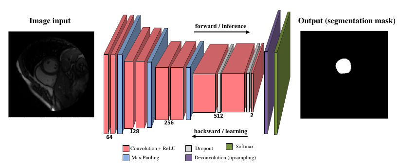
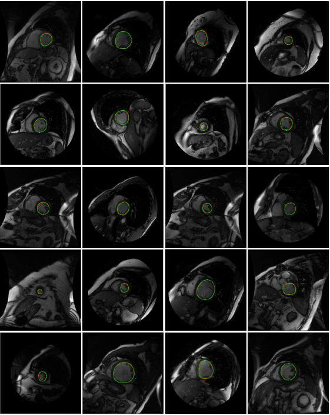

# LVNet

According to the World Health Organization, cardiovascular diseases are the leading cause of death worldwide, accounting for 17.3 million deaths per year, a number that is expected to grow to more than 23.6 million by 2030. Most cardiac pathologies involve the left ventricle; therefore, estimation of several functional parameters from a previous segmentation of this structure can be helpful in diagnosis. Manual delineation is a time consuming and tedious task that is also prone to high intra and inter-observer variability. Thus, there exists a need for automated cardiac segmentation method to help facilitate the diagnosis of cardiovascular diseases.

**LVNet** is a deep fully convolutional neural network architecture to address this issue and assess its performance. The model was trained end to end in a supervised learning stage from whole cardiac MRI images input and ground truth to make a per pixel classification.

On our paper we use Caffe framework. For the present code Tensorflow deep learning framework was used over an NVidia Quadro K4200 Graphics Processing Unit. Others Nvidia GPU souch as GTX750 can be used. Also CPU can be used but the training will take a long time.

The net architecture is: Conv64-ReLU (2x) – MaxPooling – Conv128-ReLU (2x) – MaxPooling – Conv256-ReLU (2x) – MaxPooling – Conv512-ReLu-Dropout (2x) – Conv2-ReLU – Deconv – Crop – Softmax.

Training and testing processes were carried out using 5-fold cross validation with short axis cardiac magnetic resonance images from [Sunnybrook Database](https://www.cardiacatlas.org/studies/sunnybrook-cardiac-data/).

On our paper (issing Caffe framework) we report a Dice score of 0.92 and 0.90, Hausdorff distance of 4.48 and 5.43, Jaccard index of 0.97 and 0.97, sensitivity of 0.92 and 0.90 and specificity of 0.99 and 0.99, overall mean values with SGD and RMSProp, respectively. The tensorflow version of the LVNet present similars results.

Caffe version of LVNet will be updated very soon here on GitHub.

Keywords: Image segmentation, medical image processing, cardiac MRI, Convolutional Neural Networks, deep learning.

#### Results
Some examples of obtained left ventricle using LVNet, the green contour represents the results of proposed method while the red represents the ground truth contour.

#### LVNet paper
- [Liset Vázquez Romaguera ; Francisco Perdigón Romero ; Marly Guimarães Fernandes Costa  and Cicero Ferreira Fernandes Costa Filho
" Left ventricle segmentation in cardiac MRI images using fully convolutional neural networks ", Proc. SPIE 10134, Medical Imaging 2017: Computer-Aided Diagnosis, 101342Z (March 3, 2017);](https://www.researchgate.net/publication/314177000_Left_ventricle_segmentation_in_cardiac_MRI_images_using_fully_convolutional_neural_networks)[doi:10.1117/12.2253901](http://dx.doi.org/10.1117/12.2253901)

#### Citing LVNet
When citing LVNet in academic papers and thesis, please use this BibTeX entry:

    @proceeding{doi:10.1117/12.2253901,
    author = {Vázquez Romaguera, Liset and Romero, Francisco Perdigón and Costa, Marly Guimarães Fernandes and Costa Filho, Cicero Ferreira Fernandes},
    title = {Left ventricle segmentation in cardiac MRI images using fully convolutional neural networks},
    journal = {Proc. SPIE},
    volume = {10134},
    number = {},
    pages = {101342Z-101342Z-11},
    year = {2017},
    doi = {10.1117/12.2253901},
    URL = { http://dx.doi.org/10.1117/12.2253901},
    eprint = {}
    }

#### License

MIT License

Copyright (c) 2017 Liset Vázquez Romaguera, Francisco Perdigón Romero

Permission is hereby granted, free of charge, to any person obtaining a copy
of this software and associated documentation files (the "Software"), to deal
in the Software without restriction, including without limitation the rights
to use, copy, modify, merge, publish, distribute, sublicense, and/or sell
copies of the Software, and to permit persons to whom the Software is
furnished to do so, subject to the following conditions:

The above copyright notice and this permission notice shall be included in all
copies or substantial portions of the Software.

THE SOFTWARE IS PROVIDED "AS IS", WITHOUT WARRANTY OF ANY KIND, EXPRESS OR
IMPLIED, INCLUDING BUT NOT LIMITED TO THE WARRANTIES OF MERCHANTABILITY,
FITNESS FOR A PARTICULAR PURPOSE AND NONINFRINGEMENT. IN NO EVENT SHALL THE
AUTHORS OR COPYRIGHT HOLDERS BE LIABLE FOR ANY CLAIM, DAMAGES OR OTHER
LIABILITY, WHETHER IN AN ACTION OF CONTRACT, TORT OR OTHERWISE, ARISING FROM,
OUT OF OR IN CONNECTION WITH THE SOFTWARE OR THE USE OR OTHER DEALINGS IN THE
SOFTWARE.
